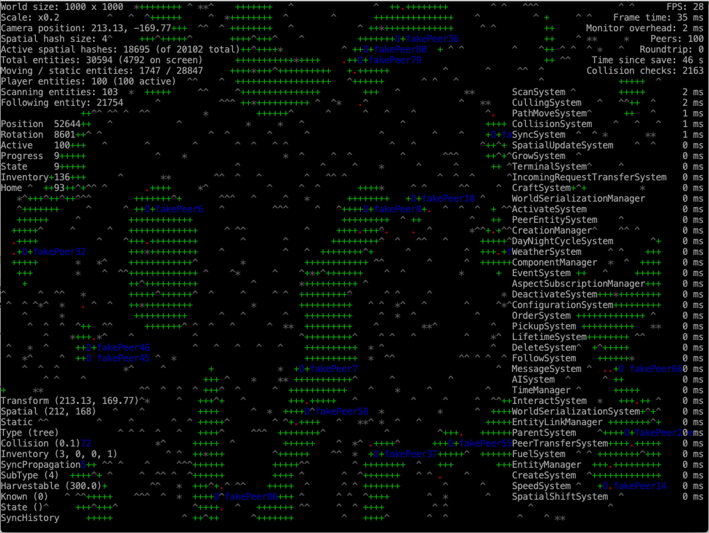

# Vast Multiplayer Server

Multiplayer server using an ECS implementation with [Artemis ODB](https://github.com/junkdog/artemis-odb) and networking with [Toast Haste](https://github.com/nhn/toast-haste.framework).

## Build

Mac:

`./gradlew fatJar`

Windows:

`gradlew.bat fatJar`

## Run

`java -jar build/libs/vast-server-all.jar -simulate 500 -monitor`

The `monitor` argument will enable the visual monitor where most aspects of the server simulation can be inspected.
